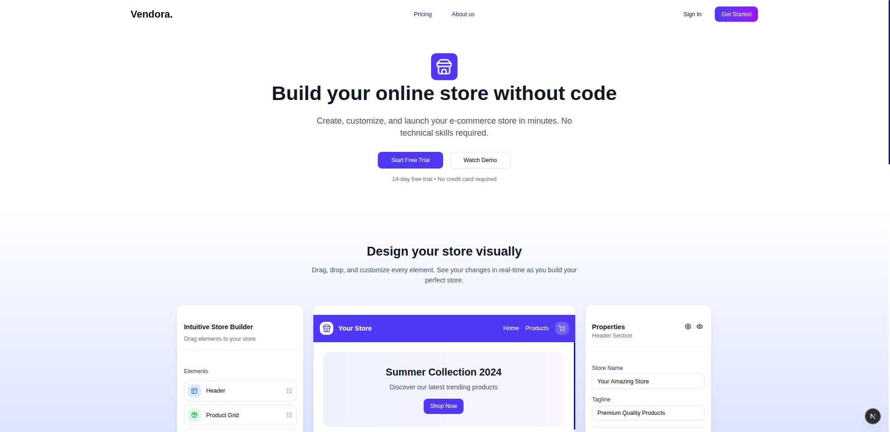
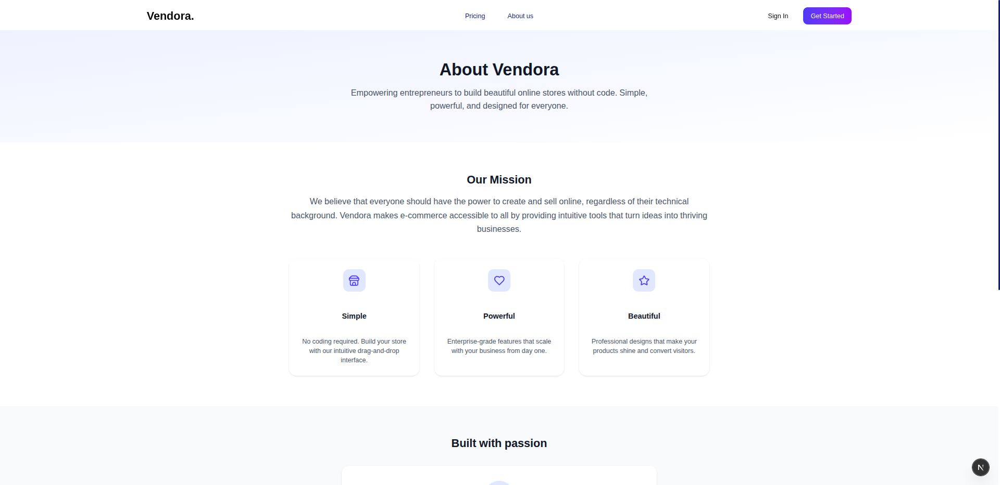
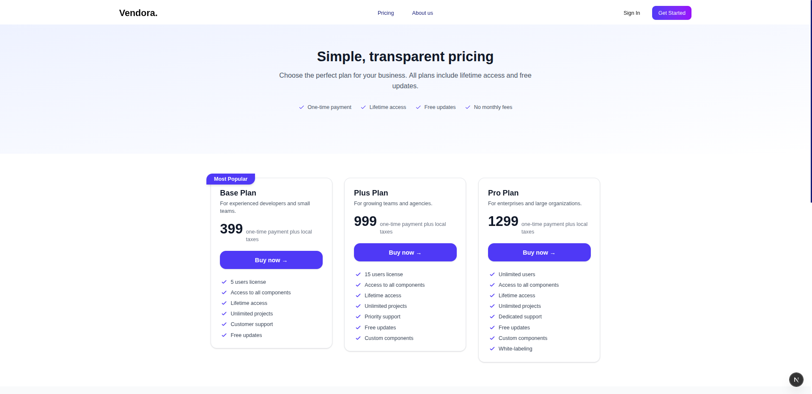

<div align="center">

# Vendora


**A Modern E-commerce Platform for Vendors and Customers**

Vendora is a comprehensive e-commerce solution that empowers vendors to manage their online stores while providing customers with a seamless shopping experience. Built with modern web technologies for optimal performance and user experience.

</div>

## 🖼️ Screenshots

### Home Experience





### Vendor Dashboard


## ✨ Features

- **Multi-vendor Marketplace** - Support for multiple vendors with individual dashboards
- **Comprehensive Analytics** - Real-time sales tracking and performance metrics
- **Product Management** - Easy-to-use interface for adding and managing products
- **Order Processing** - Streamlined order management and fulfillment system
- **Customer Relations** - Built-in customer management and communication tools
- **Responsive Design** - Optimized for desktop, tablet, and mobile devices
- **Modern UI/UX** - Clean, intuitive interface built with modern design principles

## 🛠️ Tech Stack

- **Frontend**: Next.js 14 (App Router)
- **Styling**: Tailwind CSS
- **Font Optimization**: Geist Font Family
- **TypeScript**: Full type safety
- **Performance**: Built-in Next.js optimizations

## 🚀 Getting Started

### Prerequisites
- Node.js 18.0 or later
- npm, yarn, pnpm, or bun

### Installation

1. **Clone the repository**
   ```bash
   git clone https://github.com/yourusername/vendora.git
   cd vendora
   ```

2. **Install dependencies**
   ```bash
   npm install
   # or
   yarn install
   # or
   pnpm install
   # or
   bun install
   ```

3. **Run the development server**
   ```bash
   npm run dev
   # or
   yarn dev
   # or
   pnpm dev
   # or
   bun dev
   ```

4. **Open your browser**
   Navigate to [http://localhost:3000](http://localhost:3000) to see the application.

5. **Start developing**
   Edit `app/page.tsx` to start customizing your application. The page auto-updates as you make changes.

## 📁 Project Structure

```
vendora/
├── app/                    # Next.js App Directory
│   ├── globals.css        # Global styles
│   ├── layout.tsx         # Root layout
│   └── page.tsx          # Homepage
├── components/            # Reusable UI components
├── lib/                   # Utility functions and helpers
├── public/               # Static assets
│   ├── assets/          # Logo and brand assets
│   └── ScreenShots/     # Application screenshots
│       ├── Home/        # Homepage screenshots
│       └── vendor dashboard/  # Dashboard screenshots
├── styles/               # Additional stylesheets
└── types/               # TypeScript type definitions
```

## 🌟 Key Highlights

- **Performance First**: Built with Next.js 14 for optimal loading speeds
- **Font Optimization**: Uses Geist font family with automatic optimization
- **Scalable Architecture**: Modular design for easy feature additions
- **Developer Experience**: Hot reloading and TypeScript support

## 📚 Learn More

To learn more about the technologies used in this project:

- [Next.js Documentation](https://nextjs.org/docs) - Learn about Next.js features and API
- [Learn Next.js](https://nextjs.org/learn) - Interactive Next.js tutorial
- [Next.js GitHub Repository](https://github.com/vercel/next.js) - Contribute to Next.js

## 🚢 Deployment

### Deploy on Vercel

The easiest way to deploy Vendora is using the [Vercel Platform](https://vercel.com/new?utm_medium=default-template&filter=next.js&utm_source=create-next-app&utm_campaign=create-next-app-readme):

1. Push your code to GitHub
2. Import your repository to Vercel
3. Vercel will automatically detect Next.js and configure the build settings
4. Your app will be deployed with a custom URL

Check out the [Next.js deployment documentation](https://nextjs.org/docs/app/building-your-application/deploying) for more deployment options.

## 🤝 Contributing

Contributions are welcome! Please feel free to submit a Pull Request.

## 📄 License

---

<div align="center">

Built with ❤️ 
</br>
Made by Sushil | [Portfolio](https://soocil.tech) | [Linked In](https://linkedin.com/in/sushilre)

</div>
